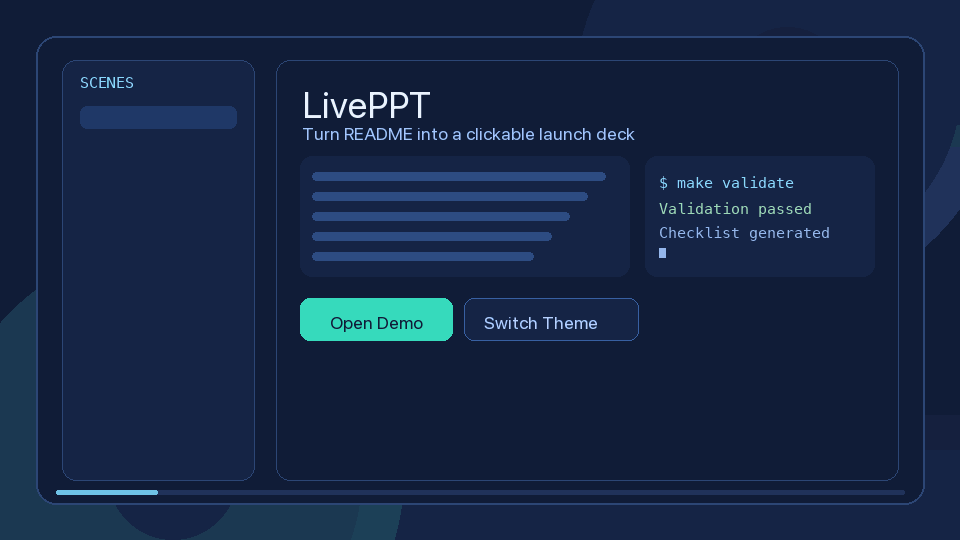

**English** | [简体中文](README.md)

<div align="center">

# LivePPT

**Turn Markdown / README into clickable, shareable HTML presentation pages.**

[](LICENSE)
[](https://github.com/AIPMAndy/LivePPT/actions/workflows/validate-skill.yml)
[](https://github.com/AIPMAndy/LivePPT/stargazers)



</div>

---

## What LivePPT Is

LivePPT is not a traditional slide tool, and it is not just a prettier README template.

It is closer to a **presentation-page generator**:
- take Markdown content or a plan
- run one command
- get a standalone HTML deck you can open, present, and share

In one line: **turn content into a usable result first, then upgrade the presentation quality over time.**

## Who It Is For

- open-source maintainers who want their README to explain the project faster
- product builders who need launch pages, pitch pages, or course handouts quickly
- people who do not want to build a frontend app from scratch just to present content

## Why HTML Output Comes First

Most first-time users come here because they want one thing:
**a working HTML showcase page**.

So the main path is now:
**content -> HTML**

`scripts/generate_showcase_plan.py` is still available as a helper when you need a draft first,
but the primary product value is the final HTML result, not an intermediate planning file.

## 30-Second Quick Start

```bash
git clone https://github.com/AIPMAndy/LivePPT.git
cd LivePPT
make validate
```

### Fastest Path: Build an HTML deck directly from README

```bash
make build-from-readme \
  README_INPUT=README.md \
  OUTPUT=dist/readme-deck.html \
  STYLE=prism-command \
  BRAND="LivePPT"
```

Then open it directly:

```bash
open dist/readme-deck.html
```

### If you do not have content yet, generate HTML in one command

```bash
make build-showcase \
  PROJECT="AI Product Launch Web Showcase" \
  AUDIENCE="Technical Decision Makers" \
  STYLE=neo-luxury \
  BRAND="LivePPT" \
  PLAN=plans/showcase.md \
  OUTPUT=dist/index.html
```

This path is useful when:
- your README already contains the core narrative
- you want a quick presentation result first
- you do not want to maintain a separate intermediate content file yet

## Two Common Workflows

### Workflow 1: I already have Markdown, just render HTML

```bash
make render-html \
  PLAN=examples/sample-launch-plan.md \
  OUTPUT=dist/index.html \
  STYLE=cyber-pulse \
  BRAND="LivePPT"
```

Best for:
- users who already wrote the content
- users who want a result quickly

### Workflow 2: I do not have content yet, generate Markdown first

```bash
python3 scripts/generate_showcase_plan.py \
  --project "AI Product Launch Web Showcase" \
  --audience "Technical Decision Makers" \
  --style "neo-luxury" \
  --output plans/showcase.md

python3 scripts/render_plan_to_html.py \
  plans/showcase.md \
  --output dist/index.html \
  --theme neo-luxury \
  --brand "LivePPT"
```

Best for:
- users who need help structuring the narrative first
- users who want an editable content draft before refining it

## Run the Existing Demo Locally

```bash
cd demos/liveppt-promo
python3 -m http.server 4188
# open http://localhost:4188
```

## Current Core Capabilities

- `scripts/build_showcase.py`: one-command Markdown draft + HTML generation
- `scripts/build_from_readme.py`: render an existing README into an HTML deck
- `scripts/render_plan_to_html.py`: render Markdown into a standalone HTML deck
- `scripts/generate_showcase_plan.py`: generate a structured Markdown draft
- `scripts/add_theme.py`: generate theme token CSS
- supports theme, brand name, and cover subtitle parameters
- supports slide navigation, progress bar, dot navigation, and keyboard controls

## Common Commands

```bash
# Validate project docs and scripts
make validate

# Generate Markdown draft + HTML in one command
make build-showcase \
  PROJECT="AI Product Launch Web Showcase" \
  AUDIENCE="Technical Decision Makers" \
  STYLE=neo-luxury \
  BRAND="LivePPT" \
  PLAN=plans/showcase.md \
  OUTPUT=dist/index.html

# Render existing Markdown directly to HTML
make render-html \
  PLAN=examples/sample-launch-plan.md \
  OUTPUT=dist/index.html \
  STYLE=prism-command \
  BRAND="LivePPT"

# Render README directly to a deck
make build-from-readme \
  README_INPUT=README.md \
  OUTPUT=dist/readme-deck.html \
  STYLE=prism-command \
  BRAND="LivePPT"

# Generate a theme token file
python3 scripts/add_theme.py \
  --name midnight-luxe \
  --bg "#09090b" \
  --surface "#15151a" \
  --text "#f4f4f5" \
  --accent "#d4af37" \
  --motion "cubic-bezier(0.22, 1, 0.36, 1)" \
  --output themes/midnight-luxe.css
```

## Current Boundaries

This version already solves:
- Markdown / README -> HTML
- fast generation of a presentable, shareable output
- switching the same content across different visual themes

This version does not fully solve yet:
- lossless conversion of arbitrary READMEs into high-fidelity launch pages
- automatic recognition of complex layouts
- one-click export of a full static site bundle
- a richer page template system

So the right mental model for now is:
**an MVP for turning content into a presentation page**, not the final form of a fully automatic launch-page engine.

## Use Cases

- open-source launches: turn changelogs into 6-10 scene stories
- B2B demos: switch the same narrative across different visual styles
- course content: break dense material into paced presentation pages
- product intros: lighter than building a frontend app, stronger than a plain README

## Roadmap

- `v0.1.x`: workflow, scripts, docs, and CI are stable
- `v0.2.x`: improve HTML output quality, layout templates, and theme system
- `v0.3.x`: add README-to-deck flow, richer template ecosystem, and full static-site export

See [ROADMAP.md](ROADMAP.md) for details.

## Open Source Docs

- [SKILL.md](SKILL.md)
- [CONTRIBUTING.md](CONTRIBUTING.md)
- [CHANGELOG.md](CHANGELOG.md)
- [OPEN_SOURCE_LAUNCH_CHECKLIST.md](OPEN_SOURCE_LAUNCH_CHECKLIST.md)
- [releases/v0.1.2.md](releases/v0.1.2.md)
- [releases/distribution-pack-2026-03-03.md](releases/distribution-pack-2026-03-03.md)

## License

`MIT + Additional Terms`

- Chinese terms: `LICENSE`
- English terms: `LICENSE_EN.md`

---

If this project helps you, please give it a **Star**, or open an Issue and tell me which template capability you want most.
